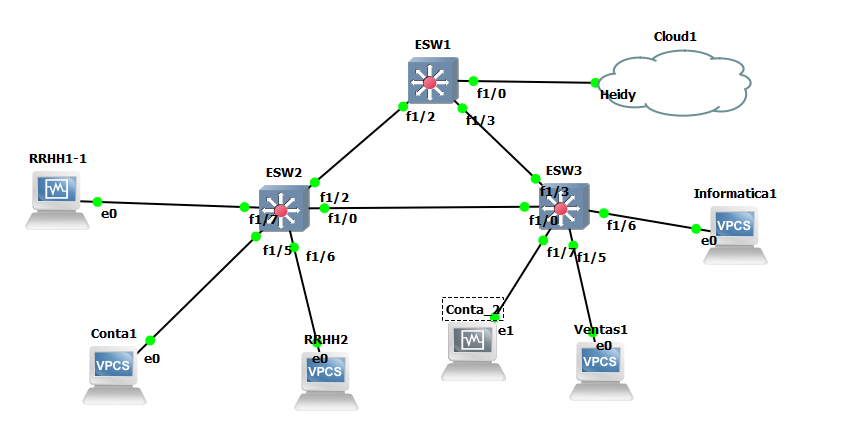
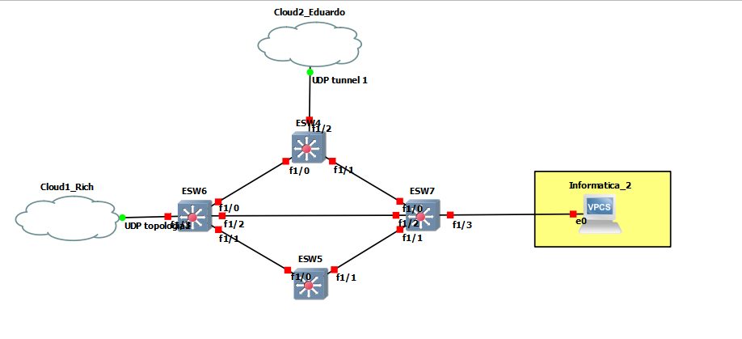
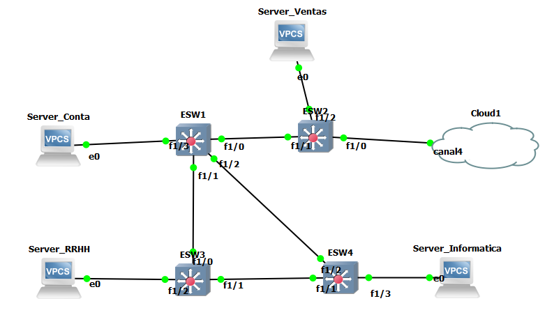
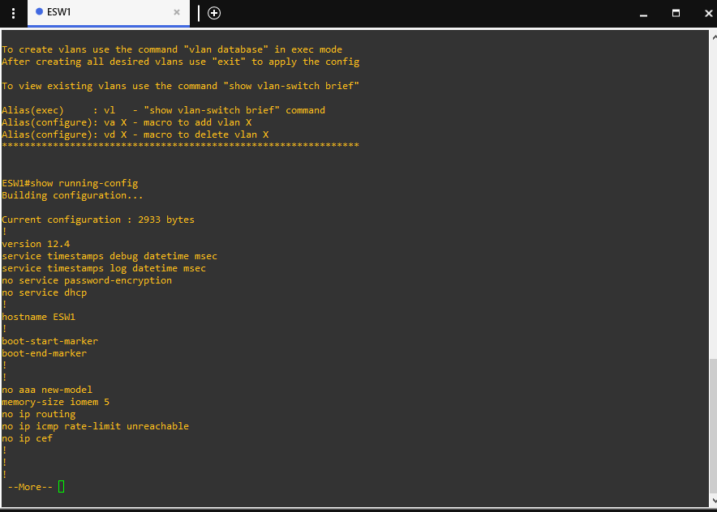
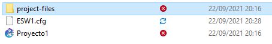

# Redes de computadora 1
## _Proyecto 1_

### Conduct Report
Se debe configurar y administrar el cableado estructurado para una empresa de venta, se
les proporciona el diseño de la topología de red que será utilizado como infraestructura de
red para dicha compañía, pero deberán de configurarla para proveer comunicación de
acuerdo a las necesidades que se indican.
### Datos Estudiantes
| Nombre | Carné |
| ------ | ------ |
| Heidy Carolina Castellanos de León | 201612282 |
| Eduardo Saul Tun Aguilar | 201612124|
| Ricardo Antonio Dubon Contreras  | 201612131 |

- ### Requerimientos de equipo de Equipo
  - ## Topologia 1
  - Sistema operativo Windows 10.
  - Virtual box.
  - ISO del sistema operativo de Linux Ubuntu 14.04.
  - Procesador i7-6500U core 2.5GHZ
  - 8gb de Memoria Ram ddr3l
  - GNS3 version 2.2.17
  - OpenVPN version 3.3.1.

  
  - ## Topologia 2
  - Sistema operativo Windows 10.
  - Procesador intel core i7-6500U core 2.5GHZ
  - 8gb de Memoria Ram ddr3l
  - GNS3 version 2.2.21.
  - OpenVPN version 3.3.1.
  
  
  - ## Topologia 3
  - Sistema operativo Windows 10.
  - Procesador i5-6500U core 2.5GHZ
  - 8gb de Memoria Ram ddr3l
  - GNS3 version 2.2.21.
  - OpenVPN version 3.3.1.
  

  - ## Maquina virtual de Google Cloud
  - Maquina Virtual de Google Cloud con sistema operativo Debian GNU/ Linux 10 (Buster).
  -  OpenVPN utilizada en la maquina virtual fue la 2.4.7

- ### Requerimientos Para Ejecucion del Archivo GNS3
  - imagen switch c3725-adventerprisek9-mz124-15 
  - NpCap 1.9
  - WinPcap 4.1.3

- ### Comandos para la configuracion de las topologias
Comandos para crear una vlan:
  > configure terminal
  >
  > vlan #(numero que desee)
  >
  > name (nombre que desee)
  >
  > end

Comandos para asignar una vlan a un puerto:
  > configure terminal
  >
  > interfa f#/# (numero que desee)
  >
  > switchport mode access
  >
  > switchport access vlan # (numero que desee)
  >
  > end

  Comandos para asignar un puerto en modo trunk:
  > configure terminal
  >
  > interfa f#/# (numero que desee)
  >
  > switchport mode trunk
  >
  > end

Comandos para visualizar las vlans creadas:
  > show vlan-switch

Comandos para configuracion vtp:
  > vtp v2-mode
  >
  > configure terminal
  >
  > vtp domain (nombre que se desee)
  >
  > vtp password (la que se desee)
  >
  > vtp mode (server o client)

Comandos para configuracion stp:
  > configure terminal
  >
  > spanning-tree vlan # (numero que desee)

  - ### Carga de archivos de configuracion
  Para realizar la carga de archivos de configuracion en primer lugar se debe crear un archivo de configuracion, copiando la configuracion del switch que se desee, con el siguiente comando.

  > show running-config

  

  Luego se debe copiar y pegar todo en un documento del tipo .cfg para guardarlo y posteriormente copiar y pegarlo en otro switch.

  